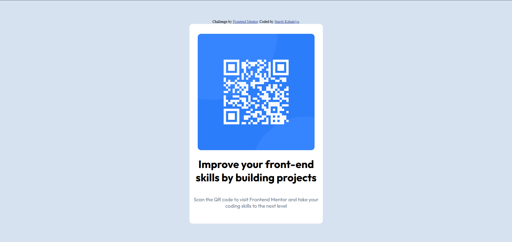

# Frontend Mentor - QR code component solution

This is a solution to the [QR code component challenge on Frontend Mentor](https://www.frontendmentor.io/challenges/qr-code-component-iux_sIO_H). Frontend Mentor challenges help you improve your coding skills by building realistic projects. 

## Table of contents

- [Overview](#overview)
  - [Screenshot](#screenshot)
  - [Links](#links)
- [My process](#my-process)
  - [Built with](#built-with)
  - [What I learned](#what-i-learned)
  - [Continued development](#continued-development)
  - [Useful resources](#useful-resources)
- [Author](#author)
- [Acknowledgments](#acknowledgments)


## Overview

### Screenshot




### Links

- Solution URL: [Add solution URL here](https://your-solution-url.com)
- Live Site URL: [Add live site URL here](http://127.0.0.1:5500/index.html)

## My process

### Built with

- Semantic HTML5 markup
- CSS custom properties
- Flexbox
- CSS Grid

### What I learned


---

### 📝 **What I Learned**

* I learned the basics of **HTML structure** — putting content inside simple containers.

  ```html
  <div class="box">
    
    <h1>Improve your front-end skills by building projects</h1>
    <p>Scan the QR code to visit Frontend Mentor and take your coding skills to the next level</p>
  </div>
  ```

* I got an idea of how to use **CSS** to control the look of the page.

  ```css
  .box {
    width: 400px;
    height: 600px;
    background-color: white;
    border-radius: 10px;
    display: flex;
    justify-content: center;
    align-items: center;
    text-align: center;
    flex-direction: column;
  }
  ```

* I saw how to **arrange things on the page** so they sit in the centre and look neat.

  ```css
  body {
    background-color: hsl(212, 45%, 89%);
    display: flex;
    justify-content: center;    /* horizontally center */
    align-items: center;        /* vertically center */
    height: 100vh;              /* take full screen height */
    margin: 0;                  /* remove default body margin */
    flex-direction: column;     /* stack box + attribution vertically */
  }
  ```

* I practised adding **text, images and colours** to make a small web component look better.

  ```css
  img {
    width: 350px;
    height: 350px;
    border-radius: 10px;
  }

  p {
    font-size: 15px;
    color: hsl(216, 15%, 48%);
  }
  ```

* I also learned how to **use Google Fonts** to change the style of the text easily.

  ```html
  <link href="https://fonts.googleapis.com/css2?family=Outfit:wght@100..900&display=swap" rel="stylesheet">
  ```

  ```css
  .box {
    font-family: "Outfit", sans-serif;
    font-optical-sizing: auto;
    font-weight: 400;
    font-style: normal;
  }
  ```

* Overall, I understood how **HTML and CSS work together** to build a simple, clean web layout.

---


### Continued development

In future projects I’d like to:

Practise responsiveness (making the layout adjust smoothly on mobiles, tablets and large screens using media queries or responsive units).

Get more comfortable with Flexbox and Grid so I can build more complex layouts without guessing at the properties.

Experiment with spacing, margins and padding to improve visual balance and alignment.

Try out different Google Fonts combinations and learn more about typography choices for better design.

Explore CSS variables and reusable styles so my code stays cleaner as projects grow.

Add hover effects, transitions and small animations to make components feel more interactive.


## Author

- Website - [Smriti Kshatriya](http://127.0.0.1:5500/index.html)
- Frontend Mentor - [@SmritiKshatriya](https://www.frontendmentor.io/profile/SmritiKshatriya)


